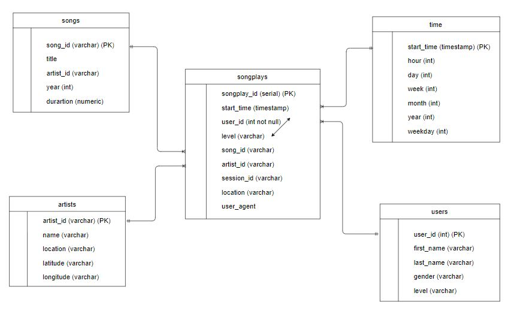

# Data Modeling with Postgres

## Introduction
A startup called Sparkify wants to analyze the data they've been collecting on songs and user activity on their new music streaming app. This project is responsible for creating Postgres database schema and ETL pipeline for the analysis. ETL pipeline includes:
- Create tables to save data
- Read song and log data in json format in to dataframe
- Transform and extract data to insert to the tables 

## Database schema design


## How to run the Python Scripts
```
python create_tables.py
python etl.py
```

## Explanation
- `test.ipynb` displays the first few rows of each table to let you check your database.
- `create_tables.py` drops and creates your tables. You run this file to reset your tables before each time you run your ETL scripts.
- `etl.ipynb` reads and processes a single file from song_data and log_data and loads the data into your tables.
- `etl.py` reads and processes files from song_data and log_data and loads them into your tables. You can fill this out based on your work in the ETL notebook.
- `sql_queries.py` contains all sql queries to create tables, insert into table, select from tables for create_tables.py and etl.py.
