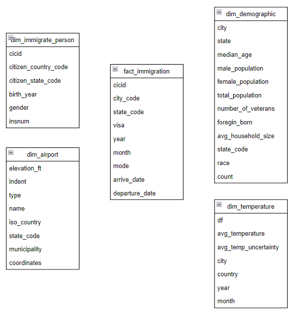

# Explore United States Immigration Data
    Udacity Data Engineering Nanodegree Capstone Project

## Overview
The Organization for Tourism Development (OTD) want to analyze migration flux in USA, in order to find insights to significantly and sustainably develop the tourism in USA. To support their core idea they have identified a set of analysis/queries they want to run on the raw data available. The project deals with building a ETL data pipeline, to go from raw data to the data insights on the migration flux.

The project includes 5 steps:
* Step 1: Scope the Project and Gather Data
* Step 2: Explore and Assess the Data
* Step 3: Define the Data Model
* Step 4: Run ETL to Model the Data
* Step 5: Complete Project Write Up

### Step 1: Scope the Project and Gather Data
#### What data 
This project using 4 datasets includes:
* I94 immigration data for year 2016. Used for the main analysis
* World Temperature Data
* Airport Code Table
* U.S. City Demographic Data

#### What tools
* Apche Spark: using to transform and analyst data
* Apache Aiflow: using to schedule tasks

### Step 2: Explore and Assess the Data

Read the file `Capstone Project Template.ipynb`

### Step 3: Define the Data Model
Conceptual data model using Star schema

### Step 4: Run Pipelines to Model the Data 
#### 4.1 Create the data model
Fact Immigration:
- Read immigration data file to dataframe
- Change data type of some columns from double to integer
- Extract columns to create fact_immigration table
- Rename columns of fact_immigration table
- Drop null records on state_code column
- Add country column to fact_immigration table
- Change date type from SAS to timestamp
- Write fact_immigration table to parquet files and partition by state_code

Dim Immigrate Person:
- Extract columns to create dim_immigrate_person from immigration data
- Rename columns of dim_immigrate_person table
- Write dim_immigrat_person table to parquet files  

Dim Temperature
- Read temperature data file to dataframe
- Filter data in United States
- Extract columns to create dim_temperature table
- Rename columns of dim_temperature
- Extract year, month from dt column
- Write dim_temperature to parquet files

Dim Demographic
- Read demographic data to dataframe
- Rename columns of dim_demographic table
- Change type of some columns to float
- Write dim_demographic table to parquet files

Dim Airport
- Read airport data to dataframe
- Convert elevation_ft to type integer
- Add state_code column to join with fact table
- Extract columns to create dim_airport table
- Write dim_airport table to parquet files

Read the file `Capstone Project Template.ipynb`

#### 4.2 Data Quality Checks
Explain the data quality checks you'll perform to ensure the pipeline ran as expected. These could include:
 * Integrity constraints on the relational database (e.g., unique key, data type, etc.)
 * Unit tests for the scripts to ensure they are doing the right thing
 * Source/Count checks to ensure completeness
 
Read the file `Capstone Project Template.ipynb`

#### 4.3 Data dictionary 
Create a data dictionary for your data model. For each field, provide a brief description of what the data is and where it came from. You can include the data dictionary in the notebook or in a separate file.
* fact_immigration
    - cicid: integer -- CIC ID
    - city_code: string -- three character abbreviation for USA city
    - state_code: string -- three character abbreviation for USA state
    - visa: integer -- visa category
    - year: integer -- 4 digits year
    - month: integer -- numeric month
    - mode: integer -- traffic mode
    - arrive_date: date -- arrive date
    - departure_date: date -- leaving date
    - country: string - 'United States'

* dim_immigrate_person
    - cicid: integer -- CIC ID
    - citizen_country_code: integer -- country of citizenship
    - citizen_state_code: integer -- state of citizenship
    - birth_year: integer -- birth year
    - gender: string -- gender
    - insnum: integer -- INS number

* dim_temperature
    - dt: timestamp -- record timestamp
    - avg_temperture: float -- monthly average temperature
    - avg_temp_uncertainty: float -- monthly average temperature uncertainty
    - city: string -- city
    - country: string -- 'United States'

* dim_demographic
    - city: string -- city
    - state: string -- state
    - median_age: float -- city median age
    - male_population: float -- city male population
    - female_population: float -- city female population
    - total_population: float -- city population
    - number_of_veterans: float -- number of veterans in city
    - foreign_born: float -- numer of foregin born baby
    - avg_household_size: float -- city average household size
    - state_code: string -- three character abbreviation for USA state
    - race: string -- respondent race
    - count: float -- count of city's individual per race

* dim_airport
    - ident: string -- unique identifier
    - type: string -- type of airport
    - name: string -- name of airport
    - elevation_ft: integer -- altitude of the airport
    - iso_country: string -- ISO code of the country of the airport
    - state_code: string -- three character abbreviation for USA state
    - municipality: string -- city where the airport is located
    - coordinates: string -- GPS coordinates of the airport

### Step 5: Complete Project Write Up

Read the file `Capstone Project Template.ipynb`